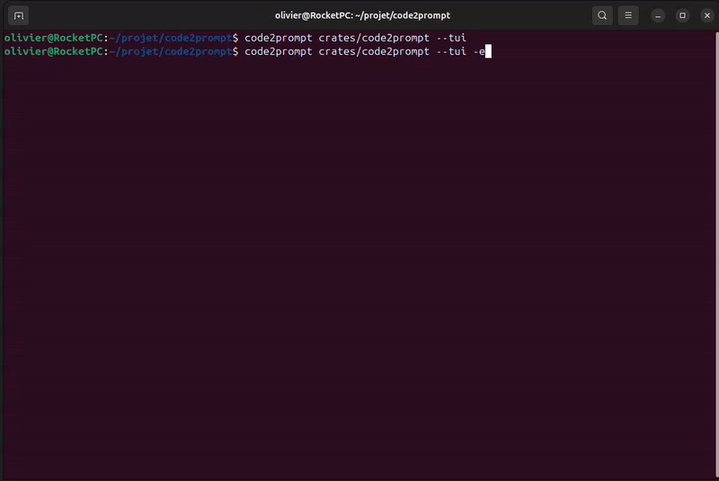
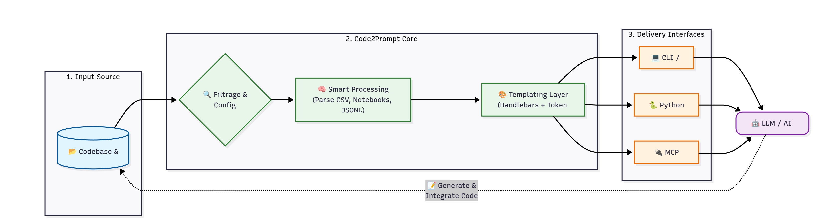

<div align="center">
  <a href="https://code2prompt.dev">
    
  </a>
  <br>
  <h3>Convert your codebase into a single LLM prompt.</h3>
</div>

<p align="center">
  <a href="https://code2prompt.dev"><b>Website</b></a> •
  <a href="https://code2prompt.dev/docs/welcome/"><b>Documentation</b></a> •
  <a href="https://discord.com/invite/ZZyBbsHTwH"><b>Discord</b></a>
</p>

<div align="center">

[](https://github.com/mufeedvh/code2prompt/blob/master/LICENSE)
[](https://crates.io/crates/code2prompt)
[](https://pypi.org/project/code2prompt-rs/)
[](https://github.com/mufeedvh/code2prompt/actions)
[](https://discord.com/invite/ZZyBbsHTwH)
[](https://docs.rs/code2prompt-core)
[](https://crates.io/crates/code2prompt)
[](https://github.com/mufeedvh/code2prompt)

</div>

---

<h1 align="center">
  <a href="https://code2prompt.dev"></a>
</h1>



**Code2Prompt** is a powerful context engineering tool designed to ingest codebases and format them for Large Language Models. Whether you are manually copying context for ChatGPT, building AI agents via Python, or running a MCP server, Code2Prompt streamlines the context preparation process.

## ⚡ Quick Install

### Cargo

```bash
cargo install code2prompt 
```

To enable optional Wayland support (e.g., for clipboard integration on Wayland-based systems), use the `wayland` feature flag:

```bash
cargo install --features wayland code2prompt
```

### Homebrew

```bash
brew install code2prompt
```

### SDK with pip 🐍

```bash
pip install code2prompt-rs
```

## 🚀 Quick Start

Once installed, generating a prompt from your codebase is as simple as pointing the tool to your directory.

**Basic Usage**: Generate a prompt from the current directory and copy it to the clipboard.

```sh
code2prompt .
```

**Save to file**:

```sh
code2prompt path/to/project --output prompt.txt
```

## 🌐 Ecosystem

Code2Prompt is more than just a CLI tool. It is a complete ecosystem for codebase context.

| 🧱 Core Library <br><br>| 💻 CLI Tool <br> | 🐍 Python SDK <br> | 🤖 MCP Server  |
| :---: | :---: | :---: | :---: |
| The internal, high-speed library responsible for secure file traversal, respecting `.gitignore` rules, and structuring Git metadata. | Designed for humans, featuring both a minimal CLI and an interactive TUI. Generate formatted prompts, track token usage, and outputs the result to your clipboard or stdout. | Provides fast Python bindings to the Rust Core. Ideal for AI Agents, automation scripts, or deep integration into RAG pipelines. Available on PyPI. | Run Code2Prompt as a local service, enabling agentic applications to read your local codebase efficiently without bloating your context window. |

## 📚 Documentation

Check our online [documentation](https://code2prompt.dev/docs/welcome/) for detailed instructions

## ✨ Features

Code2Prompt transforms your entire codebase into a well-structured prompt for large language models. Key features include:

- **Terminal User Interface (TUI)**: Interactive terminal interface for configuring and generating prompts
- **Smart Filtering**: Include/exclude files using glob patterns and respect `.gitignore` rules
- **Flexible Templating**: Customize prompts with Handlebars templates for different use cases
- **Automatic Code Processing**: Convert codebases of any size into readable, formatted prompts
- **Token Tracking**: Track token usage to stay within LLM context limits
- **Smart File Reading**: Simplify reading various file formats for LLMs (CSV, Notebooks, JSONL, etc.)
- **Git Integration**: Include diffs, logs, and branch comparisons in your prompts
- **Blazing Fast**: Built in Rust for high performance and low resource usage

Stop manually copying files and formatting code for LLMs. Code2Prompt handles the tedious work so you can focus on getting insights and solutions from AI models.

## Alternative Installation

Refer to the [documentation](https://code2prompt.dev/docs/how_to/install/) for detailed installation instructions.

### Binary releases

Download the latest binary for your OS from [Releases](https://github.com/mufeedvh/code2prompt/releases).

### Source build

Requires:

- [Git](https://git-scm.org/downloads), [Rust](https://rust-lang.org/tools/install) and `Cargo`.

```sh
git clone https://github.com/mufeedvh/code2prompt.git
cd code2prompt/
cargo install --path crates/code2prompt
```

## ⭐ Star Gazing

[](https://star-history.com/#mufeedvh/code2prompt&Date)

## 📜 License

Licensed under the MIT License, see <a href="https://github.com/mufeedvh/code2prompt/blob/master/LICENSE">LICENSE</a> for more information.

## Liked the project?

If you liked the project and found it useful, please give it a :star: !

## 👥 Contribution

Ways to contribute:

- Suggest a feature
- Report a bug
- Fix something and open a pull request
- Help me document the code
- Spread the word
