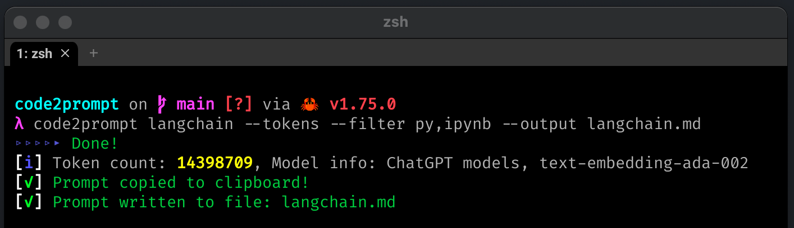

# `code2prompt` 💻📝

A CLI tool to generate LLM prompts from your codebase with prompt templating and token counting.

> I initially wrote this for personal use to utilize Claude 3.0's 200K context window and it has proven to be pretty useful so I decided to open-source it!

[](https://crates.io/crates/code2prompt)
[](https://github.com/mufeedvh/code2prompt/blob/master/LICENSE)

<h1 align="center">
  <a href="https://github.com/mufeedvh/code2prompt"></a>
</h1>

## Table of Contents

* [Features](#features)
* [Installation](#installation)
* [Usage](#usage)
* [Build From Source](#build-from-source)
* [Contribution](#contribution)
* [License](#license)
* [Support The Author](#liked-the-project)

## Features

- Quickly generate LLM prompts from codebases of any size.
- Customize prompt generation with Handlebars templates. (See the [default template](src/default_template.hbs))
- Follows `.gitignore`.
- Filter and exclude files by extension.
- Display the token count of the generated prompt. (See [Tokenizer](#Tokenizer) for more details)
- Copy the generated prompt to the clipboard on generation.
- Save the generated prompt to an output file.

## Installation

Download the latest binary for your OS from [Releases](https://github.com/mufeedvh/code2prompt/releases) OR install with `cargo`:

```
$ cargo install code2prompt
```

## Usage


Generate a prompt from a codebase directory:

```
code2prompt path/to/codebase
```

Use a custom Handlebars template file:

```
code2prompt path/to/codebase -t path/to/template.hbs
```

Filter files by extension:

```
code2prompt path/to/codebase -f rs,toml
```

Exclude files by extension:

```  
code2prompt path/to/codebase -e txt,md
```

Display token count of the generated prompt:

```
code2prompt path/to/codebase --tokens
```

Specify tokenizer for token count:

```
code2prompt path/to/codebase --tokens -e p50k
```

Supported tokenizers: `c100k`, `p50k`, `p50k_edit`, `r50k_base`.

> [!NOTE]  
> See [Tokenizers](#Tokenizers) for more details.

Save the generated prompt to an output file:

```
$ code2prompt path/to/codebase -o output.txt  
```

## Tokenizers

Tokenization is implemented using [`tiktoken-rs`](https://github.com/zurawiki/tiktoken-rs). `tiktoken` supports these encodings used by OpenAI models:

| Encoding name           | OpenAI models                                                             |
| ----------------------- | ------------------------------------------------------------------------- |
| `cl100k_base`           | ChatGPT models, `text-embedding-ada-002`                                  |
| `p50k_base`             | Code models, `text-davinci-002`, `text-davinci-003`                       |
| `p50k_edit`             | Use for edit models like `text-davinci-edit-001`, `code-davinci-edit-001` |
| `r50k_base` (or `gpt2`) | GPT-3 models like `davinci`                                               |

For more context on the different tokenizers, see the [OpenAI Cookbook](https://github.com/openai/openai-cookbook/blob/66b988407d8d13cad5060a881dc8c892141f2d5c/examples/How_to_count_tokens_with_tiktoken.ipynb)

## How is it useful?

`code2prompt` makes it easy to generate prompts for LLMs from your codebase. It traverses the directory, builds a tree structure, and collects information about each file. You can customize the prompt generation using Handlebars templates. The generated prompt is automatically copied to your clipboard and can also be saved to an output file. `code2prompt` helps streamline the process of creating LLM prompts for code analysis, generation, and other tasks.

## Build From Source

### Prerequisites

For building `code2prompt` from source, you need to have these tools installed:

* [Git](https://git-scm.org/downloads)
* [Rust](https://rust-lang.org/tools/install) 
* Cargo (Automatically installed when installing Rust)

```
$ git clone https://github.com/mufeedvh/code2prompt.git
$ cd code2prompt/
$ cargo build --release
```

The first command clones the `code2prompt` repository to your local machine. The next two commands change into the `code2prompt` directory and build it in release mode.

## Contribution

Ways to contribute:

- Suggest a feature
- Report a bug  
- Fix something and open a pull request
- Help me document the code
- Spread the word

## License

Licensed under the MIT License, see <a href="https://github.com/mufeedvh/code2prompt/blob/master/LICENSE">LICENSE</a> for more information.

## Liked the project?

If you liked the project and found it useful, please give it a :star: and consider supporting the author!
