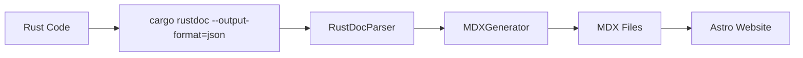

# Documentation Generation Pipeline

## Overview

This tool generates API reference documentation by transforming Rust documentation into MDX files for the Astro website.

## Architecture



### Components

- **RustDocParser** (`src/parser.ts`): Extracts public API items from rustdoc JSON
- **MDXGenerator** (`src/generator.ts`): Transforms parsed data into MDX with frontmatter
- **Main Transformer** (`src/main.ts`): Orchestrates the complete pipeline
- **Integration Script** (`../../update-docs.cjs`): Website-level command for easy updates

## Usage

### From Website Root
```bash
npm run update-api-docs  # Update API documentation
npm run docs:full        # Update docs + build website
```

### From Tool Directory
```bash
cd website/tools/doc-to-mdx
npm run build && npm start
```

## Configuration

Edit `config.json` to modify:
- Target crates
- Output directory  
- Module mappings and ordering

```json
{
  "crateNames": ["code2prompt-core"],
  "outputDir": "../../src/content/docs/docs/references/api",
  "baseUrl": "/docs/references/api",
  "moduleMapping": {
    "configuration": {
      "order": 1,
      "description": "Configuration builder and management APIs"
    },
    "session": {
      "order": 2, 
      "description": "Session management and workflow orchestration"
    }
  }
}
```

## Generated Files

API documentation is generated in:
`website/src/content/docs/docs/references/api/`

Each module becomes an MDX file with:
- Astro frontmatter (title, description, sidebar config)
- Generated content sections for structs/functions/traits

### Example Generated Structure
```
src/content/docs/docs/references/api/
├── analysis.mdx
├── builtin_templates.mdx
├── configuration.mdx
├── core.mdx
├── csv.mdx
├── default.mdx
├── filter.mdx
├── git.mdx
├── ipynb.mdx
├── jsonl.mdx
├── mod.mdx
├── path.mdx
├── selection.mdx
├── session.mdx
├── sort.mdx
├── template.mdx
├── tokenizer.mdx
├── tsv.mdx
└── util.mdx
```

## Pipeline Flow

1. **Load Configuration** - Reads `config.json` for crate names and output settings
2. **Generate Rustdoc JSON** - Runs `cargo +nightly rustdoc --output-format=json`  
3. **Parse Documentation** - Extracts public API items from generated JSON
4. **Group by Module** - Organizes items by their parent modules
5. **Generate MDX** - Creates MDX files with proper frontmatter and content
6. **Write Files** - Outputs to configured directory for Astro website

## Development

### Adding New Crates
1. Add crate name to `config.json`
2. Update module mappings if needed
3. Run the pipeline

### Modifying Output Format
- Edit `MDXGenerator` class methods in `src/generator.ts`
- Modify frontmatter generation 
- Update content sectioning logic

### Tool Scripts
- `npm run build` - Compiles TypeScript to JavaScript
- `npm start` - Runs the transformation pipeline
- `npm run dev` - Runs with ts-node for development

## Requirements

- **Node.js** - For running the TypeScript transformation tool
- **Rust Nightly Toolchain** - Required for `--output-format=json` support
- **TypeScript** - Tool is written in TypeScript

## Troubleshooting

### Common Issues

**"cargo rustdoc failed"**
- Ensure nightly Rust toolchain is installed: `rustup install nightly`
- Check if in correct directory (should run from project root)

**"Cannot find target/doc/*.json"**  
- Verify rustdoc JSON generation completed successfully
- Check cargo build succeeded before running rustdoc

**"Permission denied" on output directory**
- Verify write permissions for `website/src/content/docs/docs/references/api/`
- Ensure parent directories exist

**"Module not found" during build**
- Run `npm install` in the doc-to-mdx directory
- Verify TypeScript compilation: `npm run build`

### Debugging

1. **Verify rustdoc JSON generation:**
   ```bash
   cd /path/to/code2prompt
   cargo +nightly rustdoc --lib -p code2prompt_core -- -Z unstable-options --output-format json
   ls target/doc/code2prompt_core.json
   ```

2. **Test parser independently:**
   ```bash
   cd website/tools/doc-to-mdx  
   npm run dev
   ```

3. **Verify website integration:**
   ```bash
   cd website
   npm run update-api-docs
   npm run build
   ```

## Integration with Astro

The generated MDX files integrate seamlessly with Astro Starlight:

- **Frontmatter** provides metadata for navigation and SEO
- **Sidebar ordering** controlled via configuration
- **Content sections** follow Starlight documentation patterns
- **Multi-language support** through Astro's i18n system

## Maintenance

### Regular Tasks
- Review module mappings when adding new modules
- Update crate names list when restructuring packages  
- Verify output after major API changes
- Test full pipeline before releases

### Performance Considerations
- Tool processes all configured crates on each run
- Large codebases may require longer rustdoc generation
- Consider caching for development workflows